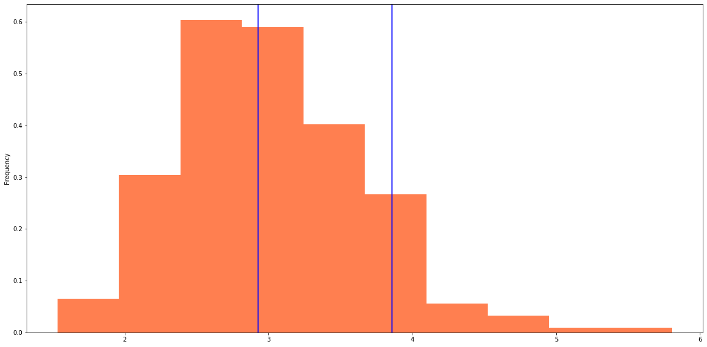

John Millar
05-APIs Homework
6/6/2020

# Financial Planner report

## Budget Analysis

### Expendetures

* Spending Categories Pie Chart

Payments and transfers are the two largest expendetures. Since you shouldn't stop paying your bills, Food and Drink, the third largest expenditure is the only area you could make cut backs.

   

* Spending Per Month Bar Chart.

Expenditures on a monthly basis are very stable which makes planning more simplistic.

   

### Income

* Last Year's Income Before Tax: $7,285

* Current Monthly Income: $500

* Projected Year's Income Before Tax: $7,389

Seven thousand a year seems a little low, we'll assume in our retirement planning phase that these are monthly numbers.

## Portfolio Ananysis

###  Retirement Planner

#### Monte Carlo Simulation

* After running 500 simulations with a 30 year time frame, the profolio always ends up higher over a 30 year period.

   
    

#### Retirement Analysis

* When we group the simulations by frequency, we see the most common scenarios of a dollar investment today would yeild $100 to $300 return in 30 years with $200 being the most likely.

   

### Financial Report

* The Monte Carlo Simulation shows a high probablity that this profilio will have increased over a 30 year period and most likely around a 200 increase from an initial invest of one dollar.

### Optional Challenge — Early Retirement

* The Monte Carlo Simulations do not show a great divergence or likely increase in the first 5 years. Therefore an early retirement requiring the same level of withdraws would require an increase in the investment amount.

   

* If we adjust the profolio by increasing stocks from 60 to 80 and decreasing bonds from 40 to 20, we do see a widening of the simulations, but not a dramatic increase. Therefore, there won't be a dramatic change in confidence intervals.

   

* Looking at the 50th and 90th qaurtiles, we see an increase from (200-300) to (300-400) which is a positive increase

   
   
## Conclusion

### 30 Year Retirement Plan Option

* Based on the the probablity of returns over 30 years at the 10th quartile (conservative probablity), an initial invest of only $20,000 (and no additional investments) would not yeild a high enough return for a 4 percent withdraw rate to cover current expenses.

* However, an ititial investment of $30,000 would be more than enough at the most conservative quartile.

### 5 Year Retirement Plan Option

* In order to retire in 5 years, there would need to be a substantial increase in the initial deposit even looking at the 90th quartile. Instead of a $30,000 investment for around $2 million in 30 years, you'd need close to $1 million to have around $2 million in only 5 years.
